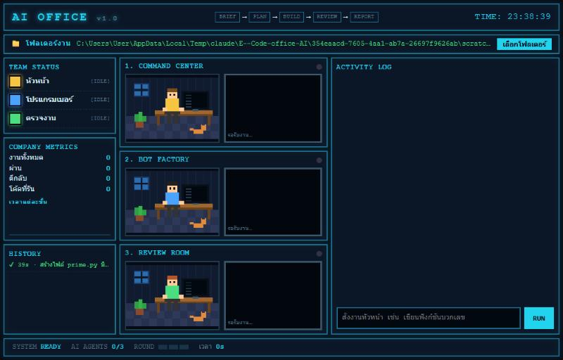
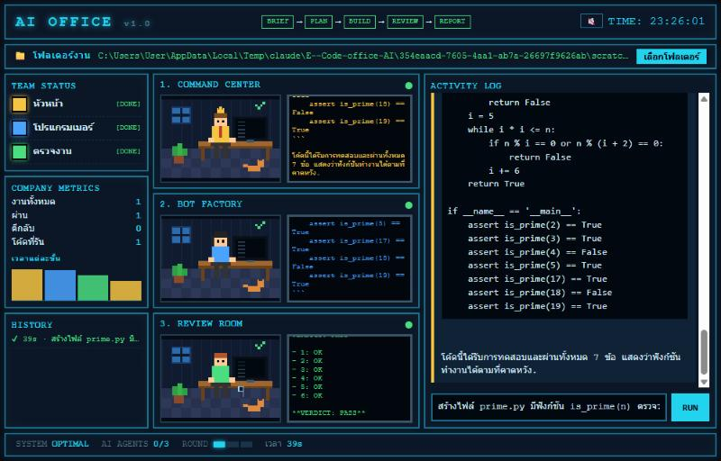

# AI Office

ออฟฟิศ AI ที่มีพนักงาน 3 ตำแหน่ง ทำงานร่วมกันผ่าน [Ollama](https://ollama.com) (โมเดลรันในเครื่องคุณเอง ไม่ส่งข้อมูลออกเน็ต) แสดงผลเป็นห้องออฟฟิศ pixel art และเขียน/แก้ไฟล์ในโฟลเดอร์ที่คุณเลือกได้

| ตำแหน่ง | หน้าที่ |
|---|---|
| **BOSS** หัวหน้า | แปลงคำสั่งเป็นสเปก ประเมินว่างานง่ายหรือยาก และสรุปผลตอนจบ |
| **DEV** โปรแกรมเมอร์ | เขียนโค้ดตามสเปก พร้อม assert ทดสอบตัวเอง |
| **QA** ตรวจงาน | ตรวจโค้ดทีละข้อ โดยดูผลรันจริงประกอบ ไม่ผ่านจะตีกลับให้ DEV แก้ (สูงสุด 3 รอบ) |





## ติดตั้งและเริ่มใช้งาน

### 1. เตรียม Ollama (ทำครั้งเดียว)
1. ติดตั้ง Ollama จาก https://ollama.com/download
2. ดึงโมเดล (เปิด Terminal แล้วรัน):
   ```
   ollama pull qwen2.5:7b
   ollama pull qwen2.5-coder:7b
   ```
   งานยากระบบจะสลับไปใช้โมเดลใหญ่ ถ้าอยากให้ใช้ได้ด้วย ให้ดึงเพิ่ม (ใช้แรมมากและช้ากว่า):
   ```
   ollama pull qwen2.5:14b
   ollama pull qwen2.5-coder:14b
   ```
   ถ้าเครื่องแรมน้อย แก้ชื่อโมเดลเป็นรุ่นเล็ก เช่น `qwen2.5:3b` ได้ที่ `roles.json`
3. ติดตั้ง [Python 3.10+](https://www.python.org/downloads/) ไว้ด้วย เพราะระบบใช้รันโค้ดทดสอบให้ QA

### 2. เปิดแอป (เลือกอย่างใดอย่างหนึ่ง)
- **ไฟล์ .exe (ง่ายสุด):** โหลด `AIOffice-win64.zip` จากหน้า [Releases](../../releases) แตก zip แล้วเปิด `AIOffice\AIOffice.exe` (Windows อาจเตือน SmartScreen เพราะยังไม่ได้เซ็นชื่อ กด "More info → Run anyway")
- **จากซอร์ส:**
  ```
  pip install -r requirements.txt
  python office_app.py
  ```
  หรือเปิดแบบเว็บ: `python server.py` แล้วเข้า http://localhost:8000

## วิธีใช้

1. **เลือกโฟลเดอร์งาน** กดปุ่ม "เลือกโฟลเดอร์" ที่แถบ 📁 ด้านบน (ข้ามได้ ถ้าเลือกไม่ AI จะแสดงโค้ดให้ก๊อปอย่างเดียว ไม่เขียนไฟล์) ระบบจำโฟลเดอร์ไว้ให้ครั้งหน้า
2. **พิมพ์คำสั่ง** ที่ช่องล่างขวา แล้วกด RUN เช่น
   - `สร้างไฟล์ prime.py มีฟังก์ชัน is_prime(n) ตรวจว่าเป็นจำนวนเฉพาะหรือไม่`
   - `แก้ไฟล์ hello.py ให้ greet รับพารามิเตอร์ lang='en' ถ้า lang เป็น 'th' คืน 'สวัสดี, <name>!'`
3. **ดูทีมทำงาน** ตามลำดับ BRIEF → PLAN → BUILD → REVIEW → REPORT (แถบด้านบน)
   - ห้องที่มีไฟกะพริบคือคนที่กำลังทำงาน จอแสดงข้อความที่โมเดลกำลังพิมพ์
   - ถ้า QA ตีกลับ (✘ FAIL) DEV จะโบกมือและแก้ใหม่ (นับรอบที่ช่อง ROUND ล่างจอ)
4. **ดูผล** ที่ ACTIVITY LOG ด้านขวา: โค้ดมีปุ่ม COPY, แถว ⚙ คือผลรันโค้ดจริง และเมื่อ QA ให้ PASS ระบบจะเขียนไฟล์ลงโฟลเดอร์งาน
5. **ประวัติ/สถิติ** ซ้ายมือ: TEAM STATUS (ใครว่าง/ทำงาน), COMPANY METRICS (จำนวนงาน ผ่าน ตีกลับ กราฟเวลาแต่ละขั้น), HISTORY (8 งานล่าสุด)

### เคล็ดลับ
- **ระบุชื่อไฟล์ในคำสั่งเสมอ** (เช่น `hello.py`) เพื่อให้ระบบรู้ว่าจะเขียนไฟล์ไหน และส่งเนื้อไฟล์เดิมให้ DEV อ่านเวลาแก้
- **งานหนึ่งงานต่อหนึ่งไฟล์** ยังแก้หลายไฟล์พร้อมกันไม่ได้
- งานเล็กเสร็จใน 30 วินาที งานยากใช้โมเดลใหญ่ อาจ 2–5 นาที
- ถ้าขึ้นข้อความ ⚠ ตรวจว่า Ollama รันอยู่ และชื่อโมเดลใน `roles.json` ตรงกับที่ดึงมา (`ollama list`)
- ไฟล์ที่ถูกเขียนทับจะถูกสำรองไว้ที่ `<โฟลเดอร์งาน>/.office_bak/`

## ปรับแต่ง
- `roles.json` — โมเดลและ prompt ของแต่ละตำแหน่ง (`model` ปกติ, `hard_model` สำหรับงานยาก)
- `rules.md` — กติกาของออฟฟิศ ส่งให้ทุกตำแหน่งอ่านทุกครั้ง (Definition of Done, ข้อพลาดที่เจอบ่อย)
- ข้อมูลของแอป .exe (โฟลเดอร์งานที่จำไว้) เก็บที่ `%APPDATA%\AIOffice`

## สร้าง .exe เอง
```
pip install pyinstaller
pyinstaller --noconfirm --windowed --name AIOffice --add-data "index.html;." --add-data "roles.json;." --add-data "rules.md;." office_app.py
```
ผลลัพธ์อยู่ที่ `dist/AIOffice/`

## ข้อควรระวัง
- โค้ดที่โมเดลเขียนถูก **รันบนเครื่องคุณจริง** (จำกัดเวลา 10 วินาที ไม่มี sandbox) และแอป **เขียนไฟล์** ในโฟลเดอร์งานได้ ควรเลือกโฟลเดอร์ที่ไม่มีข้อมูลสำคัญ หรือมี git สำรองไว้
- เซิร์ฟเวอร์ผูกกับ localhost และปฏิเสธคำขอที่มาจากเว็บอื่น
- โมเดลขนาดเล็กไม่แม่นเสมอ: QA อาจให้ผ่านทั้งที่ยังมีบั๊ก หรือตีกลับผิด ควรอ่านโค้ดก่อนนำไปใช้จริง
- ตอนนี้เหมาะกับโค้ด Python ที่สุด (ภาษาอื่นเขียนไฟล์ได้ แต่ไม่ถูกรันตรวจ)
